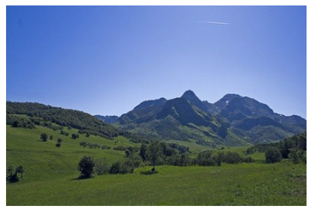
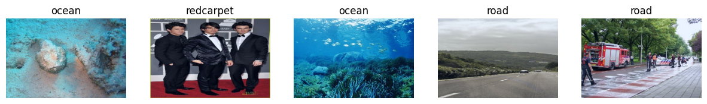

# Identifying Backgrounds! 🏞️
Using a Convolutional Neural Network with PyTorch to classify what the background of an image is!

## Analysis
Collected pictures from five different backgrounds: Grass, Ocean, Red carpet, Road, and Wheat field.

Here is a cool picture.\

Here are some with their corresponding labels.

A Convolutional Neural Network was trained with a testing and validation set to be able to classify new unseen images into one of the five different backgrounds. Full analysis is in the notebook!